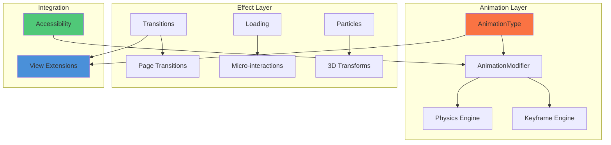

<p align="center">
  <a href="README.md">🇺🇸 English</a> |
  <a href="README_TR.md">🇹🇷 Türkçe</a>
</p>

<div align="center">

# ✨ SwiftUI Animation Masterclass

### The World's Most Comprehensive SwiftUI Animation Library

**50+ Production-Ready Animations • Zero Dependencies • Drop-In and Go**

[](https://swift.org)
[](https://developer.apple.com/ios/)
[](https://developer.apple.com/macos/)
[](https://developer.apple.com/visionos/)
[](https://swift.org/package-manager/)
[](LICENSE)

[Features](#-features) • [Installation](#-installation) • [Quick Start](#-quick-start) • [Animation Catalog](#-animation-catalog) • [Documentation](#-documentation)

</div>

---

## 🏆 What Makes This Library #1?

| Feature | This Library | Lottie | Built-in SwiftUI |
|---------|-------------|--------|------------------|
| **Animations** | 50+ ready-to-use | JSON only | Basic |
| **Dependencies** | Zero | Heavy | - |
| **Learning Curve** | Minutes | Hours | Medium |
| **Bundle Size** | ~50KB | ~500KB+ | - |
| **3D Transforms** | ✅ Full | ❌ | Limited |
| **Physics Engine** | ✅ Built-in | ❌ | ❌ |
| **Particle System** | ✅ Complete | ❌ | ❌ |
| **Keyframe API** | ✅ Native | Via JSON | iOS 17+ |
| **visionOS** | ✅ Ready | Limited | ✅ |
| **Accessibility** | ✅ Full | Partial | ✅ |

---

## ✨ Features

### 🎬 50+ Production-Ready Animations
- **10 Attention Seekers**: bounce, shake, pulse, wobble, swing, heartbeat, flash, tada, jello, rubberBand
- **16 Entrance Animations**: fadeIn, slideIn, zoomIn, bounceIn, flipIn, dropIn, rollIn, and directional variants
- **16 Exit Animations**: fadeOut, slideOut, zoomOut, bounceOut, flipOut, hinge, rollOut, and directional variants
- **8 Continuous Animations**: spin, float, glow, breathe, shimmer, wave, orbit

### 🔄 20+ Transition Presets
- Fade, Slide, Zoom, Flip, Cube, Cards, Parallax, Reveal, Push, Modal, Book, Carousel

### ⏳ 15+ Loading Animations
- Spinner, Dots, Pulse, Bars, Circular, Wave, Bounce, Gradient, Orbit, Ripple, Morphing, Typing, Skeleton, Shimmer, Heartbeat

### 👆 15+ Micro-Interactions
- Tap Scale, Tap Bounce, Long Press Glow, Hover Lift, Success Check, Error Shake, Like Heart, Add to Cart, Toggle Switch, Ripple Feedback, Expand/Collapse

### 📱 10+ Page Transitions
- Slide, Fade, Zoom, Flip, Cube, Cards, Parallax, Reveal, Push, Modal, Book, Carousel

### 🎯 Advanced Features
- **Physics Animations**: Gravity, Pendulum, Elastic Drag, Inertial Scroll, Magnetic Snap
- **Keyframe Animations**: Full iOS 17+ keyframe API support with presets
- **Path Animations**: Drawing, Following, Morphing, Dash Offset
- **3D Transforms**: Flip Cards, 3D Cube, 3D Carousel, Perspective Scroll, Fold Effect
- **Particle Effects**: Confetti, Snow, Sparkles, Bubbles, Customizable Emitter

### ♿ Accessibility First
- Automatic `reduceMotion` support
- Configurable fallback behaviors
- VoiceOver compatible

---

## 📦 Installation

### Swift Package Manager

```swift
dependencies: [
    .package(url: "https://github.com/muhittincamdali/SwiftUI-Animation-Masterclass.git", from: "2.0.0")
]
```

### Xcode

1. File → Add Package Dependencies
2. Enter: `https://github.com/muhittincamdali/SwiftUI-Animation-Masterclass.git`
3. Click Add Package

---

## 🚀 Quick Start

### Basic Animation

```swift
import SwiftUIAnimationMasterclass

struct ContentView: View {
    @State private var animate = false
    
    var body: some View {
        Image(systemName: "heart.fill")
            .font(.system(size: 60))
            .foregroundStyle(.red)
            .animate(.heartbeat, trigger: $animate)
            .onTapGesture { animate.toggle() }
    }
}
```

### Loading View

```swift
LoadingView(type: .spinner, color: .blue, size: 40)

// Or with button
LoadingButton(isLoading: $isLoading, loadingType: .dots) {
    await performAction()
} label: {
    Text("Submit")
}
```

### Micro-Interactions

```swift
Button("Tap Me")
    .tapBounce { print("Tapped!") }

// Success animation
SuccessCheckView(isShowing: $showSuccess)

// Like button
LikeHeartButton(isLiked: $isLiked, size: 30)
```

### 3D Flip Card

```swift
FlipCard(isFlipped: $isFlipped) {
    // Front
    RoundedRectangle(cornerRadius: 16)
        .fill(.blue)
} back: {
    // Back
    RoundedRectangle(cornerRadius: 16)
        .fill(.red)
}
```

### Confetti Celebration

```swift
Button("Celebrate!") {
    showConfetti = true
}
.confetti(isActive: $showConfetti)
```

### Physics Animations

```swift
Circle()
    .elasticDrag(maxStretch: 100)

// Or with gravity
Circle()
    .gravity(isActive: $drop, acceleration: 9.8, bounciness: 0.6)
```

---

## 🎭 Animation Catalog

### Attention Seekers

| Animation | Preview | Usage |
|-----------|---------|-------|
| Bounce | 🔵 | `.animate(.bounce, trigger: $trigger)` |
| Shake | 🔴 | `.animate(.shake, trigger: $trigger)` |
| Pulse | 🟢 | `.animate(.pulse, trigger: $trigger)` |
| Wobble | 🟡 | `.animate(.wobble, trigger: $trigger)` |
| Swing | 🟣 | `.animate(.swing, trigger: $trigger)` |
| Heartbeat | ❤️ | `.animate(.heartbeat, trigger: $trigger)` |
| Flash | ⚡ | `.animate(.flash, trigger: $trigger)` |
| Tada | 🎉 | `.animate(.tada, trigger: $trigger)` |
| Jello | 🍮 | `.animate(.jello, trigger: $trigger)` |
| Rubber Band | 🎈 | `.animate(.rubberBand, trigger: $trigger)` |

### Entrances

| Animation | Usage |
|-----------|-------|
| Fade In | `.animate(.fadeIn, trigger: $trigger)` |
| Fade In Up | `.animate(.fadeInUp, trigger: $trigger)` |
| Fade In Down | `.animate(.fadeInDown, trigger: $trigger)` |
| Slide In | `.animate(.slideIn(from: .leading), trigger: $trigger)` |
| Zoom In | `.animate(.zoomIn, trigger: $trigger)` |
| Bounce In | `.animate(.bounceIn, trigger: $trigger)` |
| Flip In X | `.animate(.flipInX, trigger: $trigger)` |
| Flip In Y | `.animate(.flipInY, trigger: $trigger)` |
| Drop In | `.animate(.dropIn, trigger: $trigger)` |
| Roll In | `.animate(.rollIn, trigger: $trigger)` |

### Exits

| Animation | Usage |
|-----------|-------|
| Fade Out | `.animate(.fadeOut, trigger: $trigger)` |
| Slide Out | `.animate(.slideOut(to: .trailing), trigger: $trigger)` |
| Zoom Out | `.animate(.zoomOut, trigger: $trigger)` |
| Bounce Out | `.animate(.bounceOut, trigger: $trigger)` |
| Flip Out | `.animate(.flipOutX, trigger: $trigger)` |
| Hinge | `.animate(.hinge, trigger: $trigger)` |
| Roll Out | `.animate(.rollOut, trigger: $trigger)` |

### Continuous

| Animation | Usage |
|-----------|-------|
| Spin | `.animate(.spin, trigger: $trigger, repeatForever: true)` |
| Float | `.animate(.float, trigger: $trigger, repeatForever: true)` |
| Glow | `.animate(.glow, trigger: $trigger, repeatForever: true)` |
| Breathe | `.animate(.breathe, trigger: $trigger, repeatForever: true)` |
| Shimmer | `.animate(.shimmer, trigger: $trigger, repeatForever: true)` |
| Wave | `.animate(.wave, trigger: $trigger, repeatForever: true)` |
| Orbit | `.animate(.orbit, trigger: $trigger, repeatForever: true)` |

---

## ⚡ Advanced Usage

### Chained Animations with Keyframes

```swift
KeyframePresets.bouncyEntrance(trigger: $animate) {
    Text("Hello World")
}

KeyframePresets.attention(trigger: $shake) {
    Button("Attention!")
}
```

### Custom Spring Physics

```swift
// Use presets
withAnimation(SpringPresets.bouncy) {
    scale = 1.2
}

// Or custom
withAnimation(SpringPresets.custom(response: 0.4, damping: 0.6)) {
    offset = 100
}
```

### Path Animations

```swift
// Animated drawing
DrawingPathView(
    path: PathPresets.heart(in: rect),
    strokeColor: .red,
    duration: 2.0,
    trigger: $draw
)

// Follow path
PathFollowingView(path: PathPresets.spiral(in: rect)) {
    Circle()
        .fill(.blue)
        .frame(width: 20, height: 20)
}
```

### 3D Carousel

```swift
Carousel3D(currentIndex: $index, itemCount: 5, radius: 200) { i in
    RoundedRectangle(cornerRadius: 16)
        .fill(colors[i])
        .overlay(Text("Item \(i)"))
}
```

### Page Transitions

```swift
PageTransitionContainer(
    transitionType: .cube,
    currentPage: $currentPage,
    pageCount: 5
) { page in
    PageView(index: page)
}
```

### Particle System

```swift
// Snow effect
VStack { }
    .snowEffect(particleCount: 50)

// Sparkles
Image(systemName: "star.fill")
    .sparkleEffect(particleCount: 30)

// Custom confetti
ConfettiView(
    isActive: $celebrate,
    colors: [.red, .blue, .green],
    particleCount: 100
)
```

---

## 🏗️ Architecture



---

## 📁 Project Structure

```
SwiftUI-Animation-Masterclass/
├── Sources/
│   ├── SwiftUIAnimationMasterclass/   # Main exports
│   ├── Animations/                     # Core animation types
│   ├── Transitions/                    # Transition presets
│   ├── Loading/                        # Loading animations
│   ├── MicroInteractions/              # UI micro-interactions
│   ├── PageTransitions/                # Page transition system
│   ├── Physics/                        # Physics-based animations
│   ├── Keyframes/                      # Keyframe animations
│   ├── Path/                           # Path animations
│   ├── 3D/                             # 3D transforms
│   └── Particles/                      # Particle effects
├── Examples/                           # Sample projects
├── Tests/                              # Unit tests
└── Documentation/                      # Guides
```

---

## 📋 Requirements

| Platform | Minimum Version |
|----------|-----------------|
| iOS | 17.0+ |
| macOS | 14.0+ |
| watchOS | 10.0+ |
| tvOS | 17.0+ |
| visionOS | 1.0+ |
| Swift | 5.9+ |
| Xcode | 15.0+ |

---

## 📊 Performance

| Metric | Value |
|--------|-------|
| Memory Overhead | < 1KB per animation |
| CPU Impact | Minimal (Core Animation) |
| Battery | Optimized for 60fps |
| Bundle Size | ~50KB |
| Dependencies | Zero |

---

## 📖 Documentation

| Guide | Description |
|-------|-------------|
| [Getting Started](Documentation/GettingStarted.md) | Installation and basics |
| [Animation Guide](Documentation/AnimationGuide.md) | Complete animation catalog |
| [Transitions](Documentation/Transitions.md) | Page and view transitions |
| [Physics](Documentation/Physics.md) | Physics-based animations |
| [3D Effects](Documentation/3DEffects.md) | 3D transforms and effects |
| [Particles](Documentation/Particles.md) | Particle system guide |
| [Accessibility](Documentation/Accessibility.md) | Making animations accessible |
| [Best Practices](Documentation/BestPractices.md) | Performance tips |

---

## 🤝 Contributing

Contributions are welcome! Please read our [Contributing Guide](CONTRIBUTING.md).

```bash
git clone https://github.com/muhittincamdali/SwiftUI-Animation-Masterclass.git
cd SwiftUI-Animation-Masterclass
open Package.swift
```

---

## 📄 License

MIT License — see [LICENSE](LICENSE) for details.

---

<div align="center">

## 👨‍💻 Author

**Muhittin Camdali**

[](https://github.com/muhittincamdali)
[](https://linkedin.com/in/muhittincamdali)

---

**⭐ Star this repo if you find it useful!**

---

## 📈 Star History

<a href="https://star-history.com/#muhittincamdali/SwiftUI-Animation-Masterclass&Date">
 <picture>
   <source media="(prefers-color-scheme: dark)" srcset="https://api.star-history.com/svg?repos=muhittincamdali/SwiftUI-Animation-Masterclass&type=Date&theme=dark" />
   <source media="(prefers-color-scheme: light)" srcset="https://api.star-history.com/svg?repos=muhittincamdali/SwiftUI-Animation-Masterclass&type=Date" />
   
 </picture>
</a>

</div>
