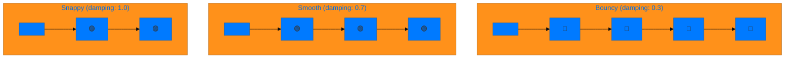

```

<p align="center">
  <a href="README.md">🇺🇸 English</a> |
  <a href="README_TR.md">🇹🇷 Türkçe</a>
</p>

 █████╗ ███╗   ██╗██╗███╗   ███╗ █████╗ ████████╗██╗ ██████╗ ███╗   ██╗
██╔══██╗████╗  ██║██║████╗ ████║██╔══██╗╚══██╔══╝██║██╔═══██╗████╗  ██║
███████║██╔██╗ ██║██║██╔████╔██║███████║   ██║   ██║██║   ██║██╔██╗ ██║
██╔══██║██║╚██╗██║██║██║╚██╔╝██║██╔══██║   ██║   ██║██║   ██║██║╚██╗██║
██║  ██║██║ ╚████║██║██║ ╚═╝ ██║██║  ██║   ██║   ██║╚██████╔╝██║ ╚████║
╚═╝  ╚═╝╚═╝  ╚═══╝╚═╝╚═╝     ╚═╝╚═╝  ╚═╝   ╚═╝   ╚═╝ ╚═════╝ ╚═╝  ╚═══╝
                    ╔═══════════════════════════════╗
                    ║   SwiftUI Animation Library   ║
                    ╚═══════════════════════════════╝
```

<p align="center">
  <a href="https://swift.org"></a>
  <a href="https://developer.apple.com/ios/"></a>
  <a href="LICENSE"></a>
  <a href="https://github.com/muhittincamdali/SwiftUI-Animation-Masterclass/stargazers"></a>
</p>

<p align="center">
  <b>Production-ready animations, transitions, and micro-interactions for SwiftUI.</b><br>
  <i>From basic easing to physics-based springs — all in one place.</i>
</p>

---

## Animation Categories

| Category | Animations | Preview |
|:---------|:-----------|:--------|
| **Spring** | `bounce`, `smooth`, `snappy` | <pre>○───────●<br>  ╭──╮ ╭╮<br>  │  ╰─╯╰─●</pre> |
| **Easing** | `linear`, `easeIn`, `easeOut` | <pre>○━━━━━━●<br>○╱──────●<br>○──────╲●</pre> |
| **Keyframe** | `multi-step`, `sequential` | <pre>○→●→◆→★<br> ↘ ↗ ↘ ↗</pre> |
| **Transition** | `slide`, `scale`, `opacity` | <pre>[█]→[▓]→[░]→[ ]</pre> |
| **Matched** | `hero`, `morph`, `expand` | <pre>◻︎ ─────▸ ◼︎</pre> |
| **Loading** | `pulse`, `spin`, `dots` | <pre>● ○ ○ → ○ ● ○</pre> |

---

## Animation Timing Flow


### Spring Response Comparison



---

## Quick Start

### Installation

**Swift Package Manager**

```swift
dependencies: [
    .package(url: "https://github.com/muhittincamdali/SwiftUI-Animation-Masterclass.git", from: "1.0.0")
]
```

### Basic Usage

```swift
import SwiftUIAnimation

struct ContentView: View {
    @State private var isActive = false
    
    var body: some View {
        Circle()
            .fill(.blue)
            .frame(width: 100, height: 100)
            .scaleEffect(isActive ? 1.5 : 1.0)
            .animation(.bouncy, value: isActive)
            .onTapGesture { isActive.toggle() }
    }
}
```

---

## Animation Examples

### Spring Animations

```
╭─────────────────────────────────────────────────────╮
│  SPRING BEHAVIOR VISUALIZATION                      │
├─────────────────────────────────────────────────────┤
│                                                     │
│  Bouncy:    ●━━╮   ╭━━╮  ╭╮ ╭╮                     │
│                 ╰━━╯  ╰━━╯╰━╯╰●                    │
│                                                     │
│  Smooth:    ●━━━━━━━━━━━━━━━━━━●                   │
│                    ╲         ╱                      │
│                     ╲━━━━━━╱                        │
│                                                     │
│  Snappy:    ●━━━━━━━━━━━━●                         │
│                                                     │
╰─────────────────────────────────────────────────────╯
```

```swift
// Bouncy - playful, energetic UI
.animation(.spring(response: 0.5, dampingFraction: 0.3), value: state)

// Smooth - elegant, professional feel
.animation(.spring(response: 0.5, dampingFraction: 0.7), value: state)

// Snappy - quick, responsive feedback
.animation(.spring(response: 0.3, dampingFraction: 1.0), value: state)
```

### Easing Curves

```
╭─────────────────────────────────────────────────────╮
│  EASING CURVE COMPARISON                            │
├─────────────────────────────────────────────────────┤
│                                                     │
│  Linear:        ╱                                   │
│               ╱                                     │
│             ╱              constant speed           │
│           ╱                                         │
│         ╱                                           │
│                                                     │
│  Ease In:           ╱                               │
│                   ╱                                 │
│                 ╱          slow → fast              │
│              ╱                                      │
│          ___╱                                       │
│                                                     │
│  Ease Out:   ╱───                                   │
│            ╱                                        │
│          ╱             fast → slow                  │
│        ╱                                            │
│      ╱                                              │
│                                                     │
│  Ease In Out:      ╱───                             │
│                  ╱                                  │
│              ___╱      slow → fast → slow           │
│                                                     │
╰─────────────────────────────────────────────────────╯
```

```swift
.animation(.linear(duration: 0.5), value: state)
.animation(.easeIn(duration: 0.5), value: state)
.animation(.easeOut(duration: 0.5), value: state)
.animation(.easeInOut(duration: 0.5), value: state)
```

### Keyframe Animations (iOS 17+)

```swift
Circle()
    .keyframeAnimator(initialValue: AnimationValues(), trigger: trigger) { content, value in
        content
            .scaleEffect(value.scale)
            .rotationEffect(value.rotation)
            .offset(y: value.offset)
    } keyframes: { _ in
        KeyframeTrack(\.scale) {
            SpringKeyframe(1.5, duration: 0.3)
            SpringKeyframe(1.0, duration: 0.3)
        }
        KeyframeTrack(\.rotation) {
            LinearKeyframe(.degrees(360), duration: 0.6)
        }
    }
```

```
╭───────────────────────────────────────────────────────────────╮
│  KEYFRAME TIMELINE                                            │
├───────────────────────────────────────────────────────────────┤
│                                                               │
│  Time:    0.0s      0.1s      0.2s      0.3s      0.4s       │
│           ┃         ┃         ┃         ┃         ┃          │
│  Scale:   ●─────────●─────────◉─────────●─────────●          │
│           1.0       1.2       1.5       1.2       1.0        │
│                                                               │
│  Rotate:  ●─────────●─────────●─────────●─────────●          │
│           0°        90°       180°      270°      360°       │
│                                                               │
│  Offset:  ●─────────●─────────●─────────●─────────●          │
│           0         -25       -50       -25       0          │
│                                                               │
╰───────────────────────────────────────────────────────────────╯
```

### Loading Animations

```swift
struct PulsingDots: View {
    @State private var phase = 0
    let timer = Timer.publish(every: 0.3, on: .main, in: .common).autoconnect()
    
    var body: some View {
        HStack(spacing: 8) {
            ForEach(0..<3, id: \.self) { i in
                Circle()
                    .fill(.blue)
                    .frame(width: 12, height: 12)
                    .scaleEffect(phase == i ? 1.5 : 1.0)
                    .animation(.spring(response: 0.3), value: phase)
            }
        }
        .onReceive(timer) { _ in
            phase = (phase + 1) % 3
        }
    }
}
```

```
╭─────────────────────────────────────────────────────╮
│  LOADING ANIMATION STATES                           │
├─────────────────────────────────────────────────────┤
│                                                     │
│  Frame 1:    ◉  ○  ○                               │
│  Frame 2:    ○  ◉  ○                               │
│  Frame 3:    ○  ○  ◉                               │
│  Frame 4:    ◉  ○  ○    (loop)                     │
│                                                     │
╰─────────────────────────────────────────────────────╯
```

### Matched Geometry Effect

```swift
struct HeroAnimation: View {
    @State private var expanded = false
    @Namespace private var namespace
    
    var body: some View {
        VStack {
            if expanded {
                // Expanded card
                RoundedRectangle(cornerRadius: 16)
                    .fill(.blue)
                    .matchedGeometryEffect(id: "card", in: namespace)
                    .frame(height: 400)
            } else {
                // Thumbnail
                RoundedRectangle(cornerRadius: 8)
                    .fill(.blue)
                    .matchedGeometryEffect(id: "card", in: namespace)
                    .frame(width: 100, height: 100)
            }
        }
        .onTapGesture {
            withAnimation(.spring(response: 0.5, dampingFraction: 0.8)) {
                expanded.toggle()
            }
        }
    }
}
```

```
╭─────────────────────────────────────────────────────╮
│  MATCHED GEOMETRY TRANSITION                        │
├─────────────────────────────────────────────────────┤
│                                                     │
│  Before:         After:                             │
│                                                     │
│  ┌────┐          ┌────────────────────────┐        │
│  │ 🔵 │    ──▸   │                        │        │
│  └────┘          │          🔵            │        │
│                  │                        │        │
│                  └────────────────────────┘        │
│                                                     │
│  100×100         width: 100% height: 400           │
│                                                     │
╰─────────────────────────────────────────────────────╯
```

### Custom Transitions

```swift
extension AnyTransition {
    static var slideScale: AnyTransition {
        .asymmetric(
            insertion: .move(edge: .bottom).combined(with: .scale(scale: 0.8)),
            removal: .move(edge: .top).combined(with: .opacity)
        )
    }
}

// Usage
if showView {
    ContentView()
        .transition(.slideScale)
}
```

---

## Performance Tips

```
╭─────────────────────────────────────────────────────╮
│  ⚡ ANIMATION PERFORMANCE CHECKLIST                 │
├─────────────────────────────────────────────────────┤
│                                                     │
│  ✅ DO:                                             │
│     • Animate transform properties (scale, offset)  │
│     • Use .drawingGroup() for complex views         │
│     • Prefer spring over custom timing curves       │
│     • Keep animated view hierarchy shallow          │
│                                                     │
│  ❌ DON'T:                                          │
│     • Animate frame/size directly                   │
│     • Use .animation() without value parameter      │
│     • Nest too many animated containers             │
│     • Animate during list scrolling                 │
│                                                     │
╰─────────────────────────────────────────────────────╯
```

### GPU vs CPU Animations

| Property | Rendering | Performance |
|:---------|:----------|:------------|
| `opacity` | GPU | ⚡⚡⚡ Excellent |
| `scaleEffect` | GPU | ⚡⚡⚡ Excellent |
| `rotationEffect` | GPU | ⚡⚡⚡ Excellent |
| `offset` | GPU | ⚡⚡⚡ Excellent |
| `frame` | CPU | ⚡ Avoid |
| `cornerRadius` | CPU | ⚡⚡ OK |
| `shadow` | CPU | ⚡ Expensive |

### Optimization Example

```swift
// ❌ Bad: Animates frame (CPU intensive)
Rectangle()
    .frame(width: expanded ? 300 : 100)
    .animation(.spring(), value: expanded)

// ✅ Good: Animates scale (GPU accelerated)
Rectangle()
    .frame(width: 100)
    .scaleEffect(expanded ? 3 : 1)
    .animation(.spring(), value: expanded)
```

---

## Project Structure

```
SwiftUI-Animation-Masterclass/
├── Sources/
│   └── SwiftUIAnimation/
│       ├── Animations/
│       │   ├── SpringAnimations.swift
│       │   ├── EasingAnimations.swift
│       │   └── KeyframeAnimations.swift
│       ├── Transitions/
│       │   └── CustomTransitions.swift
│       ├── Modifiers/
│       │   ├── ShimmerModifier.swift
│       │   ├── PulseModifier.swift
│       │   └── BounceModifier.swift
│       └── Extensions/
│           └── Animation+Extensions.swift
├── Examples/
│   ├── BasicExamples/
│   ├── AdvancedExamples/
│   └── RealWorldExamples/
├── Documentation/
└── Tests/
```

---

## Requirements

| Platform | Minimum Version |
|:---------|:----------------|
| iOS | 15.0+ |
| macOS | 12.0+ |
| watchOS | 8.0+ |
| tvOS | 15.0+ |
| Xcode | 15.0+ |
| Swift | 5.9+ |

> **Note**: Keyframe animations require iOS 17+

---

## Documentation

| Topic | Description |
|:------|:------------|
| [Animation Basics](Documentation/AnimationBasics.md) | Core concepts and API |
| [Spring Physics](Documentation/SpringPhysics.md) | Understanding spring parameters |
| [Timing Curves](Documentation/TimingCurves.md) | Easing and custom bezier |
| [Keyframes](Documentation/KeyframeAnimations.md) | Multi-step animations |
| [Transitions](Documentation/CustomTransitions.md) | View insertion/removal |
| [Performance](Documentation/Performance.md) | Optimization guide |

---

## Contributing

Contributions welcome! See [CONTRIBUTING.md](CONTRIBUTING.md) for guidelines.

---

## License

MIT License — see [LICENSE](LICENSE) for details.

---

<p align="center">
  <b>Bring your UI to life</b> ✨
</p>

<p align="center">
  <a href="https://github.com/muhittincamdali">@muhittincamdali</a>
</p>
